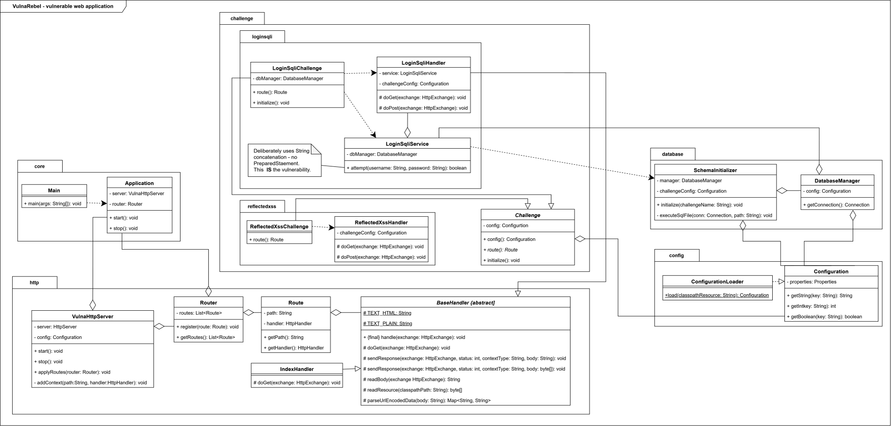
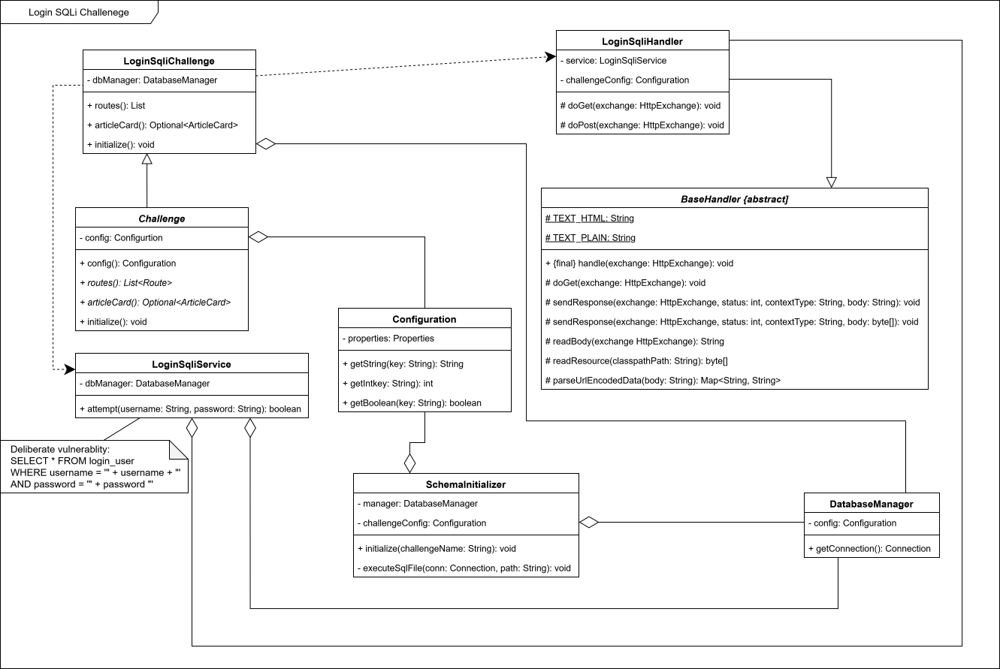
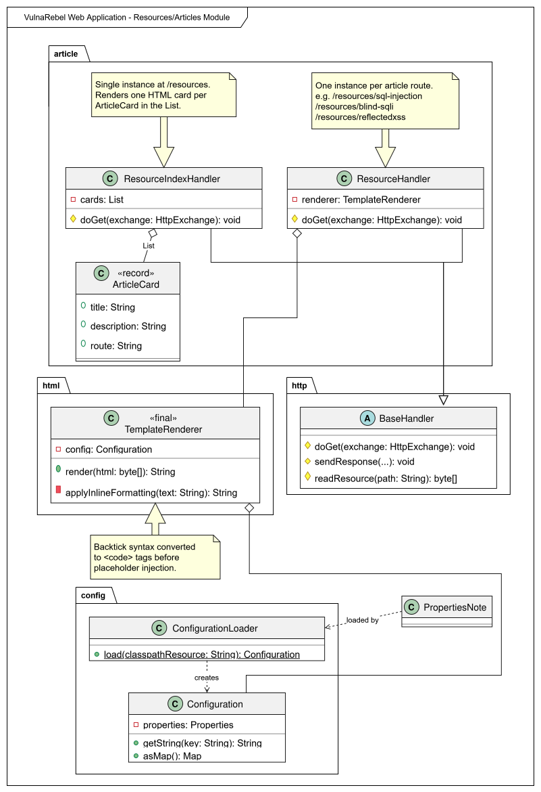

# Classdiagrams Of VulnaRebel

This document provides architectural overviews of VulnaRebel's main component groups. Each diagram was generated from PlantUML
source files located in `./resources/classdiagrams/`.

## Classdiagramm

### Application Architecture

Shows the relationship between all the application's classes.

[![](https://img.plantuml.biz/plantuml/svg/rLfRJzj857vU_ueHUQ6Ne8O22QoqQX88HGhRYj1LfMgrcjX3Cjk9xOud5IdBVzzZZntRSukXwQqljJFdyftld3CtyoeHc8lbWdcCt0Wa8iJfR2vGG3dn1Or2B_b8mnXpl42CXaIiOe8YBkPHPM36esLy4Su9fmA7Fa7xbS4O-n_nZ4p4YX6K6iNXZ16l8W7QOJ2CU4WuwknxNgw1_8WJrEfrXjtUmPs7u9_FS9AWVXmpwkCK7PA__tPtGmaBxj4TX2EeVu_QupVdw0IDezcCy5ncGG0s23tBOaQxJq3WSqG3VJYAbT5xh-B_4jFISQ5LkdwsICTtKHRSH70QpdxlW37v-E5lf5W6svMGmniwGwsZWy7XwAWQz30RMN9ZsEsOHp7XWf84RBzTlwYHaH0mW4mMt2MErV4P4OCeOWGh-4lu6VYfb35eNuJ2gKb3OT3A1LoAyh78XOsNSOG3A297RXX8E1tLx7c650LOu2bEe3BxdLwlEwecwJGVkyGXY79dTPwVNLaB53W17A7iG9cjybqlo8a_9mjy4L91CQDV30oqoItnbu9CFh4HXJxC6IYDTcekqFCgG_jrXamjGzU-dUJQgdwE6ICXFBNEHiVzuxw4ZwU9uDWNHQRNKcfqpw2TgS_84FD0ilKcJiF0J1NC-sjNpxGZ84lGwAu02F8mXucYiSOq4NgIrl2JrpWCc259hI0w9-l-UIr4V7OBr81AIcFrNIKp-qzZSuz5CnecdnW5NW-xBxilfSSIqpWLW9gWAhSFuhSfTOgSaR9AF0QOTUQsmvvcvMsKFDAC7VY4yC_Kjx4h15d48XEsje-h8wlpiSJXB0jERXZqEGbk0M9hq3_g3NjgPLmLCk-JP9l5uKgw0yAtIdp1b8qec2z2J9CaszMq3au7H_sXJbLLweUHLGNnxUXo-vqifmigDdZ_clvorZNistXUrCU7tSFXgPgfyoL913JBnpFO1wrg-8gD55u2JbxVSDGb5WHY1Ry6aJBBqihk4wSK-RJ4B2ceU3Fz5wez9K4-6JkxeZt7oNmO1VaaMsoi5A42x0Oa8YgsO0QvUuN5IKRpbkU5RImQDfm__wfXG-vSDh9Duc81UteJ7zNp3FvCBej2UCJoyf0UN8QGOhdb68q6tGEj1-5m4YoXkatD1sSwCekWCntj5v34vpIh99TOY1V65YqFJ2clrhvP8zdGE5KqFxxRiw0tm921kwmyQ39ub-RxPzn1sd3-SfF16hbpCaW8vlxSUVXI62gyMHfvocWO58tSwnyTgeqyI0L-WSolSVvocLyZRv3vlZn3DBwssUJn-spaxiixWBnCqceRTRgrgwz-fOBKYo_hSb2APBLY6nHKC6smqVJ--AbzuxIk5hhBjmp09M2Rpckt4rSaYPPSFJbixMwYxkGY3CYjpLDxkgGiI9ETEC9wF9vApSt5Wg7MS7JQEnrM2oxzVUyQ-ed1Dk2A05fUwu9AUhB10iQ7GUfykX8al-KrPyIXzBpuRTzgI5wTLM8GCPntNWpxe-CxIRPoRpR0YPRMXXUIgbZh-kpzzJ-lho_7bdvI9D-E-nT_RZk5MvY3QXsOClDLA40p8UyuEmjzQEKWlGHspiFwnNkB4nmCec3L68UPqTHCqMJkfI0hBLKzWS84zHXsyCqOoSiLvgrzENtLpn4lBUUBWuqNojy1oeV1GRt7CXZwfFNNaeKuTPMkmezk8LYe65xLvlXY995sPJpIYLgaE0Y6KIZ8hNs1Vrvob3VxVcwow7rR1-0uPgkhV4CbhMHlFBKkdwowN_abBREkhUdp770DlY8JOp7NbZFLihwumDmxW-rYEVjcSkj03Mj5zMFZqtOR5PPFKBOqSrr0BPWJ93Fi6NRCcKBzqzv9iHMIFrkrr6zD9oYOviycdNRxlpzG-H72qxR5cL5jood1mvD5GSM-Fa2ew6jQsjeAREQFkeP4Nbd5F0sbXP25IaTzM_km0EgwEgWDIPLVdagfn6v93SHbp_05fq5DsRHSDMNGKMjA-qxJY66pblRffAn4iuAhfZGDdNJDtuQQijtwDs3VfghIQRxJrw6xxk0RPS1bmEJEz6ceKTmcHJrg_RFFnWIRb4p8wuUS1cRh2dQJjIFDJcS7HM1xvyNUtjCTL3l00llfqSQiQB0lLnlLubL-ffNt89x-1m0RgjTmXzyWWJQj1_bHywrTqpSgMREMTd5UJXfc1LVoDGqzEvg_3NHexbnJk-5gjK6ER5fsK0ODDKVQxMcZ79crN9IRDRGRq3AhceAU8qrx0nsUzmhWB1ViVm00)](https://editor.plantuml.com/uml/rLfRJzj857vU_ueHUQ6Ne8O22QoqQX88HGhRYj1LfMgrcjX3Cjk9xOud5IdBVzzZZntRSukXwQqljJFdyftld3CtyoeHc8lbWdcCt0Wa8iJfR2vGG3dn1Or2B_b8mnXpl42CXaIiOe8YBkPHPM36esLy4Su9fmA7Fa7xbS4O-n_nZ4p4YX6K6iNXZ16l8W7QOJ2CU4WuwknxNgw1_8WJrEfrXjtUmPs7u9_FS9AWVXmpwkCK7PA__tPtGmaBxj4TX2EeVu_QupVdw0IDezcCy5ncGG0s23tBOaQxJq3WSqG3VJYAbT5xh-B_4jFISQ5LkdwsICTtKHRSH70QpdxlW37v-E5lf5W6svMGmniwGwsZWy7XwAWQz30RMN9ZsEsOHp7XWf84RBzTlwYHaH0mW4mMt2MErV4P4OCeOWGh-4lu6VYfb35eNuJ2gKb3OT3A1LoAyh78XOsNSOG3A297RXX8E1tLx7c650LOu2bEe3BxdLwlEwecwJGVkyGXY79dTPwVNLaB53W17A7iG9cjybqlo8a_9mjy4L91CQDV30oqoItnbu9CFh4HXJxC6IYDTcekqFCgG_jrXamjGzU-dUJQgdwE6ICXFBNEHiVzuxw4ZwU9uDWNHQRNKcfqpw2TgS_84FD0ilKcJiF0J1NC-sjNpxGZ84lGwAu02F8mXucYiSOq4NgIrl2JrpWCc259hI0w9-l-UIr4V7OBr81AIcFrNIKp-qzZSuz5CnecdnW5NW-xBxilfSSIqpWLW9gWAhSFuhSfTOgSaR9AF0QOTUQsmvvcvMsKFDAC7VY4yC_Kjx4h15d48XEsje-h8wlpiSJXB0jERXZqEGbk0M9hq3_g3NjgPLmLCk-JP9l5uKgw0yAtIdp1b8qec2z2J9CaszMq3au7H_sXJbLLweUHLGNnxUXo-vqifmigDdZ_clvorZNistXUrCU7tSFXgPgfyoL913JBnpFO1wrg-8gD55u2JbxVSDGb5WHY1Ry6aJBBqihk4wSK-RJ4B2ceU3Fz5wez9K4-6JkxeZt7oNmO1VaaMsoi5A42x0Oa8YgsO0QvUuN5IKRpbkU5RImQDfm__wfXG-vSDh9Duc81UteJ7zNp3FvCBej2UCJoyf0UN8QGOhdb68q6tGEj1-5m4YoXkatD1sSwCekWCntj5v34vpIh99TOY1V65YqFJ2clrhvP8zdGE5KqFxxRiw0tm921kwmyQ39ub-RxPzn1sd3-SfF16hbpCaW8vlxSUVXI62gyMHfvocWO58tSwnyTgeqyI0L-WSolSVvocLyZRv3vlZn3DBwssUJn-spaxiixWBnCqceRTRgrgwz-fOBKYo_hSb2APBLY6nHKC6smqVJ--AbzuxIk5hhBjmp09M2Rpckt4rSaYPPSFJbixMwYxkGY3CYjpLDxkgGiI9ETEC9wF9vApSt5Wg7MS7JQEnrM2oxzVUyQ-ed1Dk2A05fUwu9AUhB10iQ7GUfykX8al-KrPyIXzBpuRTzgI5wTLM8GCPntNWpxe-CxIRPoRpR0YPRMXXUIgbZh-kpzzJ-lho_7bdvI9D-E-nT_RZk5MvY3QXsOClDLA40p8UyuEmjzQEKWlGHspiFwnNkB4nmCec3L68UPqTHCqMJkfI0hBLKzWS84zHXsyCqOoSiLvgrzENtLpn4lBUUBWuqNojy1oeV1GRt7CXZwfFNNaeKuTPMkmezk8LYe65xLvlXY995sPJpIYLgaE0Y6KIZ8hNs1Vrvob3VxVcwow7rR1-0uPgkhV4CbhMHlFBKkdwowN_abBREkhUdp770DlY8JOp7NbZFLihwumDmxW-rYEVjcSkj03Mj5zMFZqtOR5PPFKBOqSrr0BPWJ93Fi6NRCcKBzqzv9iHMIFrkrr6zD9oYOviycdNRxlpzG-H72qxR5cL5jood1mvD5GSM-Fa2ew6jQsjeAREQFkeP4Nbd5F0sbXP25IaTzM_km0EgwEgWDIPLVdagfn6v93SHbp_05fq5DsRHSDMNGKMjA-qxJY66pblRffAn4iuAhfZGDdNJDtuQQijtwDs3VfghIQRxJrw6xxk0RPS1bmEJEz6ceKTmcHJrg_RFFnWIRb4p8wuUS1cRh2dQJjIFDJcS7HM1xvyNUtjCTL3l00llfqSQiQB0lLnlLubL-ffNt89x-1m0RgjTmXzyWWJQj1_bHywrTqpSgMREMTd5UJXfc1LVoDGqzEvg_3NHexbnJk-5gjK6ER5fsK0ODDKVQxMcZ79crN9IRDRGRq3AhceAU8qrx0nsUzmhWB1ViVm00)

### Web Application (svg)

Shows the relationship between `Main`, `Application`, `VulnaHttpServer`, `Router`, `Route`, and `BaseHandler` – the infrastructure every challenge builds on.

### Login SQL Injection (svg)

Shows how `LoginSqliChallenge` wires together `LoginHandler`, `LoginService`, `DatabaseManager`, and `SchemaInitializer` following the modular challenge pattern.

### Resources / Articles (svg)

Shows how `ResourceHandler`, `ResourceIndexHandler`, `TemplateRenderer`, and `ArticleCard` collaborate to serve the knowledge centre.

